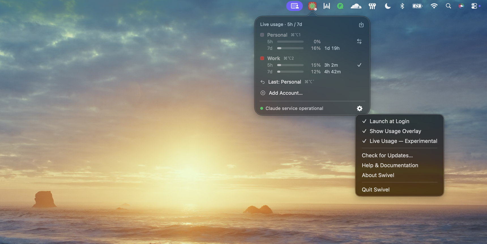
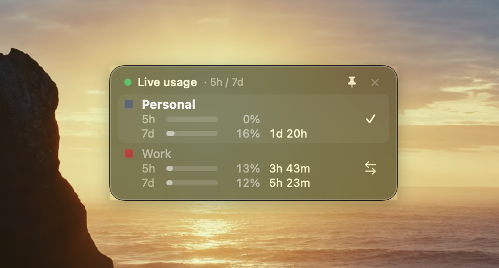
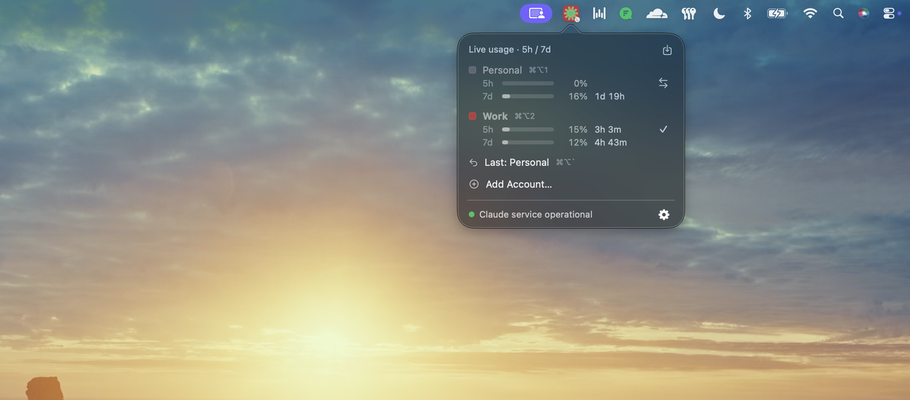

# Swivel

**Switch between Claude Desktop accounts in two seconds. No more logging out.**

[](https://github.com/jspanji/Swivel/actions/workflows/ci.yml)
[](https://github.com/jspanji/Swivel/releases)
[](LICENSE)
[](https://www.apple.com/macos/)
[](https://www.swift.org/)

Swivel lives in your menu bar. Each account gets a saved snapshot of Claude Desktop's session — cookies, auth, chat history, preferences. Bind accounts to `⌘⌥1`, `⌘⌥2`, …, and flip between Personal ↔ Work (or Client A ↔ Client B) without logging out.

> Everything runs locally. No telemetry. By default the only network request is to the public [Claude status page](https://status.claude.com) for the menu bar's service-status indicator. One **opt-in** feature — [Live Usage](#live-usage-opt-in-experimental) — additionally talks to claude.ai; it's off until you turn it on.

<p align="center"></p>

## Why

Juggling two Claude accounts — personal + work, or a couple of client logins — means signing out and back in. That kills your side panel, your conversation drafts, your MCP settings, and sometimes prompts the keychain. Swivel captures the entire Claude Desktop profile per account and swaps them atomically with a keyboard shortcut.

## Install

### Download the release

Grab `Swivel-<version>.zip` from the [latest release](https://github.com/jspanji/Swivel/releases/latest). Unzip, drag `Swivel.app` to `/Applications`, and launch it.

> First launch: macOS will warn that the app is from an unidentified developer (ad-hoc signed). Right-click the app and choose **Open** → **Open**. You only need to do this once.

### Build from source

Requires macOS 13+ and Swift 5.9+ (Xcode 15 or a standalone Swift toolchain).

```bash
git clone https://github.com/jspanji/Swivel.git
cd Swivel
./build-app.sh --install
open /Applications/Swivel.app
```

## Setup

1. Sign into your first Claude account in Claude Desktop.
2. Menu bar icon → **Add Account…** → name it (e.g. *Personal*).
3. Sign out. Sign into your second account.
4. **Add Account…** → *Work*.

You now have two accounts. **Press `⌘⌥1` or `⌘⌥2`** to switch — or open the popover and hit a row's **⇄** button. Claude quits, the session swaps, Claude relaunches. The round trip is usually under two seconds.

## Shortcuts

| Shortcut      | Action                                |
|---------------|---------------------------------------|
| `⌘⌥1` … `⌘⌥9` | Switch to account by slot             |
| `` ⌘⌥` ``     | Flip back to the previous account     |

Slots follow the order accounts appear in the popover (alphabetical). Open it to see the current mapping — each account row shows its shortcut.

## The popover

Click the menu bar icon to open a translucent glass popover:

- **Account list** — each account with its usage bar (plan, messages left, reset countdown) and shortcut. Switch with the row's **⇄** button; the active account is bold with a ✓. The usage area itself isn't clickable — switching relaunches Claude, so it's a deliberate press, not a stray click.
- **Hover "…"** on a row — rename, change color, restore a backup, or delete that account.
- **Last used** — a persistent "flip back" row. Faster than re-picking.
- **Save snapshot** (the save icon in the usage header) — re-saves the *current* account from Claude's live state. Run it occasionally so your saved profile keeps up with recent chats.
- **Add Account…** — save the current Claude session as a new account.
- **Gear menu** — Launch at Login, the Usage Overlay toggle, the Live Usage toggle, Check for Updates…, Help, About, Quit.

Right-click the menu bar icon for a compact About / Check for Updates / Quit menu.

Each account gets a colored menu bar icon so you can see which one is active at a glance. Pick the color from the row's hover "…" menu **▸ Change Color**.

## The Usage Overlay

**Gear menu ▸ Show Usage Overlay** puts a small glass panel on your desktop with every account's usage bar — same rows as the popover, always visible. By default it floats on top of your windows so you can watch your limits during a session; right-click it and toggle **Always on Top** off to tuck it behind windows (visible only on show-desktop) instead. Drag it by its title line; use a row's switch button (⇄) to switch. Position and visibility stick across launches.

<p align="center"></p>

## Live Usage (opt-in, experimental)

By default, the usage bars come from Claude Desktop's **local cache** — which only carries utilization numbers when you're actually near a rate limit, and is frozen at the last snapshot for inactive accounts.

**Gear menu ▸ Live Usage — Experimental** turns on real-time usage instead: Swivel queries `claude.ai` for each account and shows live **5-hour and 7-day** utilization, always — even when you're nowhere near a limit, and for accounts you're not currently signed into.

<p align="center"></p>

> ⚠️ **Experimental.** This relies on undocumented `claude.ai` endpoints that aren't part of any public API, so it may change or break without warning. It's off by default and never required — the local-cache bars work regardless.

This is the **one feature that sends anything off your Mac**, so it's **off until you switch it on** (with a confirmation the first time):

- It makes **read-only** requests to `claude.ai` using each account's **own saved session** — the same data the Claude website shows on its usage page. Nothing is written; nothing goes anywhere but Anthropic; only your own accounts are queried.
- Results are cached briefly so opening the popover doesn't spam the API.
- If an account's saved session has expired, that account silently falls back to the local cache.
- Turn it back off any time from the same menu.

## Backups

Every save and every switch rotates the prior snapshot into a timestamped backup. Swivel keeps the **most recent 3 backups per account**.

Restore one from the account row's hover **"…" menu ▸ Restore Backup**. The current snapshot becomes a new backup first, so you can undo the undo.

Snapshots are integrity-checked with a SHA-256 manifest. If a saved profile is ever corrupted (partial crash, disk error), Swivel refuses to restore it and surfaces the problem instead of silently propagating it to your live Claude install. Full design in [docs/ARCHITECTURE.md](docs/ARCHITECTURE.md).

## Troubleshooting

<details>
<summary><strong>"Switch failed: Profile's saved safeStorage key differs…"</strong></summary>

You reinstalled Claude Desktop, which generated a new local encryption key. The previously-saved cookies can no longer be decrypted.

**Fix:** re-save the affected account from a logged-in Claude session. **Add Account…** with the same name overwrites.
</details>

<details>
<summary><strong>"Switch failed: Profile snapshot integrity check failed…"</strong></summary>

The snapshot's manifest doesn't match its files — usually from disk corruption or a mid-snapshot crash.

**Fix:** restore a backup via the account row's hover **"…" menu ▸ Restore Backup**. Or re-save the account from a logged-in session.
</details>

<details>
<summary><strong>Keychain prompts on every switch</strong></summary>

The first save of each account reads the Claude keychain key. If you didn't click **Always Allow** at that prompt, every subsequent read re-prompts.

**Fix:** delete the account and re-add it, clicking *Always Allow* this time. Swivel does not modify the keychain on switch — so once you've approved once, switches are silent.
</details>

<details>
<summary><strong>"Launch at Login" won't toggle on</strong></summary>

Launch-at-login requires the app to live in `/Applications`.

**Fix:** run `./build-app.sh --install` rather than launching from the `build/` folder.
</details>

<details>
<summary><strong>Hotkeys don't fire</strong></summary>

macOS may ask for Accessibility or Input Monitoring permission on first launch.

**Fix:** grant it in **System Settings → Privacy & Security → Accessibility**.
</details>

<details>
<summary><strong>Gatekeeper says "Swivel.app can't be opened"</strong></summary>

The release binary is ad-hoc signed, not notarized.

**Fix:** right-click the app in Finder and choose **Open** → **Open**. You'll only need to do this once per install.
</details>

## How it works

Claude Desktop stores session data in `~/Library/Application Support/Claude/` and encrypts its cookie store with a Keychain entry (`Claude Safe Storage` / `Claude Key`).

On **save**, Swivel:
1. Reads the keychain key once — the only keychain interaction (the key is device-local and never rotates).
2. Copies the Claude folder and preferences plist into a staging directory.
3. Writes a SHA-256 manifest of every file as the "stage complete" marker.
4. Atomically promotes the staged directory over the profile via APFS `renamex_np` — a kernel-level atomic swap. A crash at any point during a save leaves either the old or new snapshot intact, never a partial merge.

On **switch**, Swivel:
1. Quits Claude and waits for it to fully exit.
2. Snapshots the current session back to the active account (so no state is lost).
3. Verifies the target account's manifest against its on-disk files.
4. Restores the target snapshot into Claude's Application Support directory.
5. Relaunches Claude.

Claude Code CLI state (`claude-code*` folders) is deliberately left in place — your terminal sessions aren't tied to the GUI account.

Full internals in [docs/ARCHITECTURE.md](docs/ARCHITECTURE.md).

## Requirements

- macOS 13 (Ventura) or later
- Claude Desktop (launched at least once, so the Application Support directory exists)
- Swift 5.9+ for building from source

## Limitations

- Don't edit Claude Desktop while a switch is in progress. The menu bar icon dims while work is in flight — wait for it to brighten.
- Keychain key rotation (rare — happens when Claude Desktop is fully reinstalled) invalidates saved cookies. Affected accounts must be re-saved.
- Release builds are ad-hoc signed, not notarized. First launch requires a right-click → Open.
- This is an unofficial tool. It's not affiliated with Anthropic.

## Uninstall

Quit Swivel, then:

```bash
rm -rf /Applications/Swivel.app
rm -rf ~/Library/Application\ Support/Swivel
```

Your Claude Desktop sessions stay where they are — uninstalling Swivel doesn't touch them.

## Contributing

PRs welcome. See [CONTRIBUTING.md](CONTRIBUTING.md) for the setup and the bar. The design doc is [docs/ARCHITECTURE.md](docs/ARCHITECTURE.md) — start there if you're touching snapshot or switch internals.

## Security

Swivel touches authentication state. If you find a vulnerability, please report it privately via the [Security tab](https://github.com/jspanji/Swivel/security/advisories/new) — not a public issue. Full policy and threat model in [SECURITY.md](SECURITY.md).

## License

[MIT](LICENSE). Unofficial tool, not affiliated with Anthropic.
